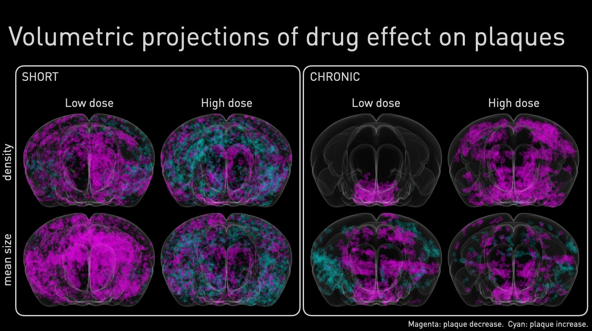
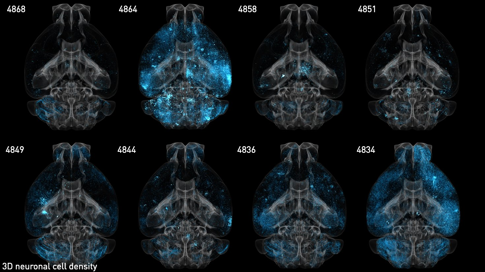

# img3D

img3 is a python package for image processing of large, 3D (volumetric) image data.

img3 is intended for:
* storing NumPy arrays in raw file format
* storing and reading image metadata from corresponding nrrd files, used in bio-imaging
* perform copmutations on image data


## Code Structure

The img3D package is organized as follows:
* [src](src/)      : Source (C and Python) files.
* [examples](examples/) : Examples of simple use cases of the package.


## Requirements

* C compiler
* numpy

## Optional requirements

* C compiler with OpenMP support
* ImageJ
* Python packages: tifffile, numba, scipy.signal

## Compilation

```
cd src
make install
```

To customize the python interpreter, C compiler, and the compilation
flags:

```
cd src
make install PY=python CC=clang CFLAGS_OPENMP= 'CFLAGS = -O2 -g'
```


## Applications

Below are results from projects where [img3D](https://github.com/aecon/img3D) modules were used.
A project-specific pipeline was developed to process and generate the quantification needed for each project.
The rendering of the generated 3D segmentations was performed with [Paraview](https://www.paraview.org).


### Project 1: Image processing for the quantification of drug efficacy

A study for the efficacy of different drugs in neurodegenerative diseases.
A novel image processing pipeline utilizing [img3D](https://github.com/aecon/img3D) modules was developed to quantify drug efficacy on the sub-cellular level, through object segmentation of stained neural cells in 3D whole mouse-brain scans.
The pipeline will be published together with the corresponding publication.




### Project 2: Quantification of drug bio-distribution through 3D image processing

An international collaboration aiming to develop a new protein-based delivery system to the central nervous system of the brain.
3D images of whole mouse-brain scans were used to detect the bio-distribution of the delivery system, using light-sheet microscopy.
Image processing was performed using a custom pipeline utilizing [img3D](https://github.com/aecon/img3D) modules.
The pipeline will be published together with the corresponding publication.




## Authors

The package was developed in the labs of Prof. Petros Koumoutsakos (ETH Zurich) and Prof. Adriano Aguzzi (University of Zurich) by
* Sergey Litvinov
* Athena Economides
* Francesca Catto
